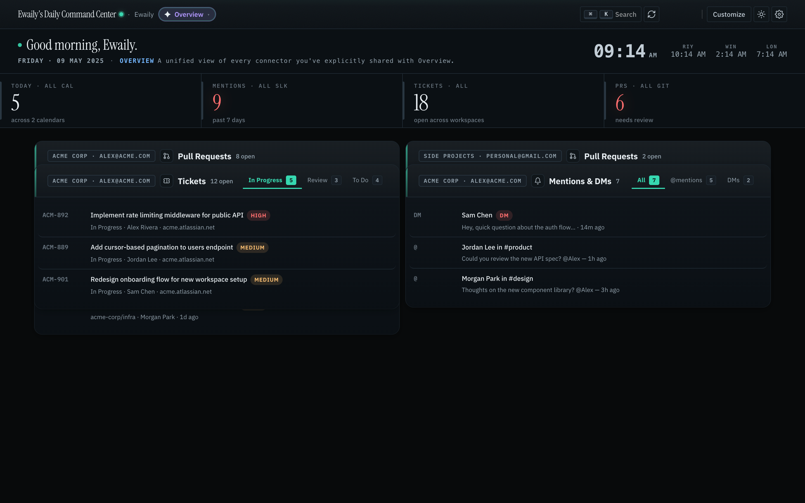
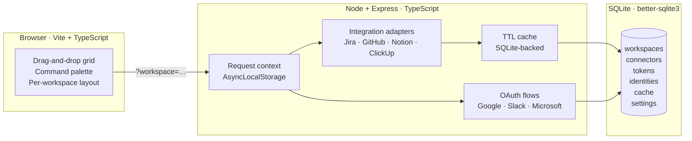

# Daily Command Center

> **One tab. Every tool. Nothing leaves your machine.**

[](./LICENSE)
[](https://github.com/Ewaily/DailyCommandCenter/actions/workflows/ci.yml)
[](https://codecov.io/gh/Ewaily/DailyCommandCenter)
[](https://nodejs.org)
[](https://www.typescriptlang.org/)
[](./docs/CONTRIBUTING.md)


---

## Why this exists

Most knowledge workers start the day with twelve open tabs: a calendar, Slack per workspace, two ticketing tools, GitHub, a docs app, and a notification panel. The information they actually need — *what's on today, who needs me, what's blocked* — is scattered across all of them.

Daily Command Center is the antidote. One local app. One grid. Seven providers. Your data stays on your machine — no cloud, no telemetry, no account required.

---

## Features at a glance

| | Feature |
|---|---|
| 📅 | **Unified Schedule** — Google Calendar + Outlook merged into one timeline with a live "Now" indicator |
| 💬 | **Channel Digest** — latest Slack messages with full rich-text rendering |
| 🔔 | **Mentions & DMs** — every place you were @-mentioned, grouped by day |
| 🎫 | **Tickets** — Jira board with dynamic watched-teammate tabs |
| ✅ | **Tasks** — ClickUp tasks, same model |
| 🔀 | **Pull Requests** — GitHub command center: Needs Review · My PRs · All Open · Closed |
| 📊 | **KPI Strip** — at-a-glance counts: meetings · mentions · tickets · PRs |
| 🏢 | **Multi-workspace** — Personal + Work side by side; credentials never cross boundaries |
| ✦ | **Overview mode** — one unified view fanned out across every workspace |
| ⌨️ | **Keyboard-first** — command palette (`⌘K`), Quick Rail (`]`), and shortcuts for everything |
| 🎨 | **Customizable grid** — drag, drop, and resize any card; layouts persist per workspace |
| 🏷️ | **White-label branding** — rename the app and subtitle from Settings |



---

## Supported integrations

| Provider | Auth | Powers |
|---|---|---|
| **Google Calendar** | OAuth | Schedule, KPIs, Quick Rail |
| **Microsoft Outlook** | OAuth | Schedule, KPIs, Quick Rail |
| **Slack** | OAuth or User Token | Channel Digest, Mentions & DMs, KPIs |
| **Jira** | API token | Tickets card, KPIs |
| **ClickUp** | Personal token | Tasks card |
| **GitHub** | Personal access token | Pull Requests card, KPIs |
| **Notion** | Integration token | Pinned databases |

Every integration is **optional** — the dashboard renders gracefully with zero credentials.

---

## Quick start

```bash
git clone https://github.com/Ewaily/DailyCommandCenter.git
cd DailyCommandCenter
npm install
npm run dev
```

Open **http://localhost:3000**. Connect tools from Settings (`,` key). That's it.

Full setup walkthroughs — OAuth registration, API tokens, redirect URIs — are in **[SETUP.md](./docs/SETUP.md)** and in the in-app **📖 View setup guide** accordions on every credentials form.

> **OAuth note.** All redirect URIs must point to port `3000` (the Node server), not `5173` (Vite). Canonical URIs: `http://localhost:3000/api/auth/{google|slack|microsoft}/callback`

---

## Architecture



- **Workspace context** travels through every request via AsyncLocalStorage, set from `?workspace=`.
- **All inputs** validated with Zod at API boundaries.
- **Third-party HTML** sanitized with `sanitize-html` before touching the DOM.
- **No framework, no state library, no CSS framework.** Small, explicit, cheap to read.

Full tech stack, project layout, and npm scripts → **[SETUP.md](./docs/SETUP.md)**.  
Exhaustive feature reference → **[FEATURES.md](./docs/FEATURES.md)**.

---

## Keyboard shortcuts

| Key | Action |
|---|---|
| `⌘K` / `Ctrl K` | Command palette |
| `R` | Refresh all modules |
| `T` | Toggle light / dark theme |
| `,` | Open Settings |
| `E` | Toggle layout edit mode |
| `]` | Toggle Quick Rail |
| `?` | Keyboard shortcut sheet |
| `G` → `S` | Jump to Schedule |
| `G` → `C` | Jump to Channel Digest |
| `G` → `M` | Jump to Mentions |

---

## Privacy & security

- **Local-only.** Every byte lives in `~/.daily-command-center/db.sqlite`. Delete the file to wipe state.
- **No cloud.** No backend service, no managed database, no telemetry.
- **Workspace isolation is absolute.** No workspace ever sees another workspace's tokens or credentials.
- **`.env` is gitignored.** CI never sees secrets.

> This app is single-user by design. If you expose port `3000` to a network without an authenticating reverse proxy, you are publishing your Slack messages to that network.

---

## Contributing

PRs welcome. See **[CONTRIBUTING.md](./docs/CONTRIBUTING.md)** for the full guide. Quick version:

1. Open an issue before non-trivial work.
2. Branch off `prod`: `git checkout -b feat/short-description`.
3. Code · test · **update docs in the same PR** — `README.md`, `FEATURES.md`, and `SETUP.md` must match before merge.
4. Open the PR against `prod`. CI typechecks and tests on Node 20 and 22.

---

## License

[MIT](./LICENSE) © Muhammad Ewaily
