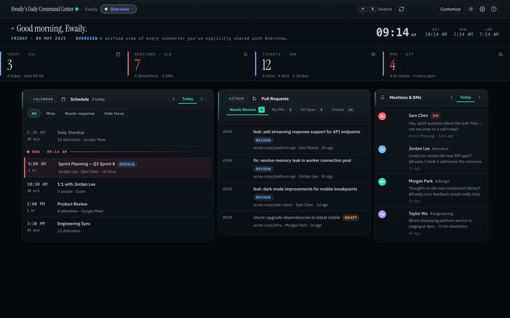
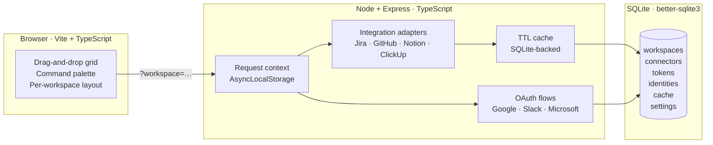

<div align="center">

# Daily Command Center

### One tab. Every tool. Nothing leaves your machine.

*A self-hosted, local-first productivity dashboard — beautifully designed, obsessively private.*

<br/>

[](./LICENSE)
[](https://github.com/Ewaily/DailyCommandCenter/actions/workflows/ci.yml)
[](https://codecov.io/gh/Ewaily/DailyCommandCenter)
[](https://nodejs.org)
[](https://www.typescriptlang.org/)
[](https://sqlite.org)
[](./docs/CONTRIBUTING.md)

<br/>

</div>

> 📸 **Screenshot Needed — Hero Image (Dark Mode)**
> Take a full-screen shot of the dashboard in **dark mode** showing the gradient header bar, the 4-tile KPI strip with live numbers, and at least 3 widget cards visible (e.g. Pull Requests, Tasks, Mentions & DMs). The shot should feel cinematic — scroll position at top, sidebar closed. Save as `docs/assets/hero-dark.png` and replace this blockquote with:
> ```md
> 
> ```

---

## Table of Contents

- [The Philosophy](#the-philosophy)
- [Feature Highlights](#feature-highlights)
- [Integrations](#integrations)
- [Architecture](#architecture)
- [Quick Start](#quick-start)
- [Full Setup Guide](#full-setup-guide)
  - [Prerequisites](#prerequisites)
  - [Branding & Preferences](#branding--preferences)
  - [Connecting Providers](#connecting-providers)
    - [Google Calendar](#google-calendar)
    - [Outlook Calendar](#outlook-calendar-microsoft-graph)
    - [Slack](#slack)
    - [GitHub, Jira & Notion](#github-jira--notion)
    - [ClickUp](#clickup)
  - [Environment Variables](#environment-variables)
  - [Common Problems](#common-problems)
- [Keyboard Shortcuts](#keyboard-shortcuts)
- [Privacy & Security](#privacy--security)
- [Contributing](#contributing)
- [License](#license)

---

## The Philosophy

Most knowledge workers start the day with twelve open tabs: a calendar, Slack per workspace, two ticketing tools, GitHub, a docs app, and a notification panel. The information they actually need — *what's on today, who needs me, what's blocked* — is scattered across all of them.

**Daily Command Center** is the antidote. One local app. One intelligent grid. Seven providers. Your data stays on your machine — no cloud, no telemetry, no account required.

> **Quiet Operator.** The design language of this dashboard is deliberately restrained and information-dense — like a high-end trading terminal or a cockpit instrument cluster. Color is earned, not decorative. Numbers are large. Labels are small. Everything that can be automated, is.

> 📸 **Screenshot Needed — Quiet Operator Light Mode**
> Capture the dashboard in **light mode**, scrolled to show the KPI strip and two or three cards side-by-side. This communicates the "clean instrument cluster" feel. Save as `docs/assets/light-mode-overview.png`.

---

## Feature Highlights

| | Feature | Detail |
|:---:|---|---|
| 📅 | **Unified Schedule** | Google Calendar + Outlook merged into one timeline with a live NOW indicator, filter chips, and day navigation |
| 💬 | **Channel Digest** | Latest messages from any Slack channel, full rich-text rendered (mentions, links, emoji, code blocks) |
| 🔔 | **Mentions & DMs** | Every @-mention and direct message, grouped by day with an urgent flag on DMs |
| 🎫 | **Tickets** | Full Jira board with dynamic watched-teammate tabs, status buckets, priority badges, and due dates |
| ✅ | **Tasks** | ClickUp board — same model as Tickets with per-workspace teammate tabs |
| 🔀 | **Pull Requests** | GitHub command center: Needs Review · My PRs · All Open · Closed, each with live count badges |
| ⚡ | **1-Click Jira Cloning** | Clone any ClickUp task or ticket to Jira in one click — no dialog, configurable per connector |
| 📊 | **Sticky KPI Strip** | Always-visible instrument strip: meetings · mentions · open tickets · PRs to review. Pins below the header as you scroll |
| 🏢 | **Multi-Workspace** | Personal + Work side by side; credentials are absolutely isolated across workspaces |
| ✦ | **Overview Mode** | One unified view fanned across every workspace — each connector gets its own independent card |
| 🎨 | **Drag & Drop Grid** | Resize, reorder, and customize any card; layout persists per workspace in localStorage |
| ⌨️ | **Keyboard-First** | Command palette (`⌘K`), Quick Rail (`]`), and shortcuts for every action |
| 🏷️ | **White-Label Ready** | Rename the app, set a subtitle, and configure secondary clocks — all from Settings |

> 📸 **Screenshot Needed — KPI Strip (Scrolled)**
> Scroll the page ~200px down so the context strip (date/greeting/clock) has disappeared. Capture the **sticky header + sticky KPI strip** floating above the widget grid with the subtle scroll-shadow visible. This demonstrates the sticky chrome behaviour. Save as `docs/assets/sticky-kpi.png`.

> 📸 **Screenshot Needed — 1-Click Clone Flow**
> Hover over a ClickUp or Jira row so the clone icon is visible. Capture the row with the clone button revealed. Then, if you can, capture the success modal with the created Jira issue key and link. Save as `docs/assets/clone-flow.png`.

---

## Integrations

| Provider | Auth Method | Powers |
|---|---|---|
| **Google Calendar** | OAuth 2.0 | Schedule card, KPIs, Quick Rail |
| **Microsoft Outlook** | OAuth 2.0 (Graph API) | Schedule card, KPIs, Quick Rail |
| **Slack** | OAuth 2.0 or User Token | Channel Digest, Mentions & DMs, KPIs |
| **Jira** | API Token | Tickets card, KPIs, Clone target |
| **ClickUp** | Personal API Token | Tasks card, Clone source |
| **GitHub** | Personal Access Token | Pull Requests card, KPIs |
| **Notion** | Integration Token | Pinned databases |

Every integration is **optional**. The dashboard renders gracefully with zero credentials and shows a helpful "Connect" state for each missing tool.

---

## Architecture



**Key decisions:**

- **Workspace context** travels through every request via `AsyncLocalStorage`, set from the `?workspace=` query parameter.
- **All API inputs** validated with [Zod](https://zod.dev) at boundaries.
- **Third-party HTML** (Slack messages, Jira descriptions) sanitized with `sanitize-html` before touching the DOM.
- **No framework, no state library, no CSS framework.** Vanilla TypeScript on both sides — small, explicit, cheap to audit.
- **SQLite cache** with configurable TTL per key wraps every expensive API call; `cached()` is the one-liner contract.
- **Instance-card registry** (`src/frontend/components/instance-card-registry.ts`) — a single `CapabilitySpec` entry covers rendering, tab state, source labels, and multi-instance placement for any connector type. Adding a new connector is one append.

Full tech stack and project layout → **[SETUP.md](./docs/SETUP.md)**  
Exhaustive feature reference → **[FEATURES.md](./docs/FEATURES.md)**

---

## Quick Start

```bash
git clone https://github.com/Ewaily/DailyCommandCenter.git
cd DailyCommandCenter
npm install
npm run dev
```

Open **[http://localhost:3000](http://localhost:3000)**.

No `.env` file required. Connect tools from **Settings** (press `,`) after the app is running. That's it.

> 📸 **Screenshot Needed — Empty State / First Launch**
> Capture the dashboard on first launch before any connectors are added — showing the workspace empty-state card with the "No tools connected yet" message and the "Open settings" CTA. This is an important onboarding moment. Save as `docs/assets/empty-state.png`.

---

## Full Setup Guide

### Prerequisites

- **Node.js 20 or later** — verify with `node --version`. Install via `brew install node@20` if missing.
- **Xcode Command Line Tools** (macOS only) — required to compile `better-sqlite3`. Run `xcode-select --install` if `npm install` fails.

---

### Branding & Preferences

All preferences are configured from the **Settings panel** (press `,`):

**Branding** — Settings → Preferences tab → Branding section
- **Project name** — replaces "Daily Command Center" in the browser tab and the header. Leave blank to use the default.
- **Header subtitle** — optional line under the greeting (owner name, team, tenant). Hidden when blank.
- Both values are stored in the local SQLite `settings` table and applied on every page load.

**Time Zones** — Settings → Preferences tab → Time zones section
- **Primary time zone** — drives the main clock, date display, schedule "Now" indicator, and all Slack/mention timestamp formatting (both client and server). Stored as `prefs.primaryTz` (IANA name).
- **Secondary clocks** — up to 3 smaller clocks. Each row takes an IANA timezone; the 3-letter label is auto-derived from the city if left blank.
- Defaults: primary `Africa/Cairo`, secondaries Riyadh / Winnipeg / London.

---

### Connecting Providers

All credentials are configured from the **Settings panel** — no `.env` editing required.

> 💡 **In-app setup guides.** Every credentials form ships with a built-in **📖 View setup guide** accordion that walks through provider-side configuration step by step — including exact redirect URIs, scopes, and where to copy each value. The sections below are a quick reference; the in-app guide is the foolproof source of truth.

#### ⚠️ Critical — OAuth Redirect URI Port

The app runs on **two ports simultaneously**:

| Port | Process | Role |
|---|---|---|
| **3000** | Node / Express | Handles all `/api/` routes **including OAuth callbacks** |
| **5173** | Vite dev server | Serves frontend assets only — **never use this for OAuth** |

When any provider asks for a **Redirect URI / Callback URL**, always use the **port 3000** version:

| Provider | Redirect URI to register |
|---|---|
| Google | `http://localhost:3000/api/auth/google/callback` |
| Slack | `http://localhost:3000/api/auth/slack/callback` |
| Microsoft / Outlook | `http://localhost:3000/api/auth/microsoft/callback` |

> Using port 5173 is the #1 cause of `redirect_uri did not match` errors. If you changed the server port via `PORT=XXXX` in `.env`, substitute that port number in every URI above.

---

#### Google Calendar

1. Open [Google Cloud Console](https://console.cloud.google.com/) → create a new project → **APIs & Services** → **Library** → enable **Google Calendar API**.
2. **APIs & Services** → **Credentials** → **Create OAuth client ID** → Web application.
   - Authorized Redirect URI: `http://localhost:3000/api/auth/google/callback`
3. Copy the **Client ID** and **Client Secret**.
4. In the app: **Settings** → **Application** tab → Google section → paste both values → **Save**.
5. **Settings** → **Workspaces** → your workspace card → **+ Connect Google Calendar ↗** to complete the OAuth flow.

---

#### Outlook Calendar (Microsoft Graph)

1. Open [portal.azure.com](https://portal.azure.com/) → **Azure Active Directory** → **App registrations** → **New registration**.
   - Supported account types: **Accounts in any organizational directory and personal Microsoft accounts**
   - Redirect URI (Web): `http://localhost:3000/api/auth/microsoft/callback`
2. Copy the **Application (client) ID**.
3. **Certificates & secrets** → **New client secret** → copy the **Value** (not the Secret ID).
4. **API permissions** → **Microsoft Graph** → **Delegated** → add: `Calendars.Read`, `User.Read`, `offline_access` → **Grant admin consent**.
5. In the app: **Settings** → **Application** tab → Microsoft section → paste Client ID and Client Secret → **Save**.
6. **Settings** → **Workspaces** → workspace card → **+ Connect Outlook Calendar ↗**. Repeat for multiple accounts.

---

#### Slack

1. Go to [api.slack.com/apps](https://api.slack.com/apps) → **Create New App** → **From scratch**.
2. **OAuth & Permissions** → **Redirect URLs** → add `http://localhost:3000/api/auth/slack/callback`.
3. **User Token Scopes** — add all of the following:

   ```
   channels:history   channels:read    groups:history    groups:read
   im:history         im:read          mpim:history      mpim:read
   search:read        users:read       users.profile:read
   ```

4. In the app: **Settings** → **Application** tab → Slack section → paste **Client ID** and **Client Secret** → **Save**.
5. **Settings** → **Workspaces** → workspace card → **+ Connect Slack ↗**.

---

#### GitHub, Jira & Notion

These use API tokens — no OAuth app registration required.

**Settings** → **Identities** tab → **+ Connect Identity** → select type → paste token.

| Provider | Where to generate the token |
|---|---|
| **GitHub** | github.com → Settings → Developer settings → Personal access tokens (classic). Scopes: `repo`, `read:user`. |
| **Jira** | id.atlassian.com → Security → API tokens → Create API token. |
| **Notion** | notion.so/my-integrations → New integration → copy **Internal Integration Token**. |

---

#### ClickUp

ClickUp uses a personal API token — no OAuth dance, no app registration. Five-minute setup:

**Step 1 — Generate the token**

Open ClickUp → click your **avatar** (bottom-left) → **Settings** → **Apps** (left sidebar) → **API Token** → **Generate** (or **Regenerate**). Copy the value — it starts with `pk_`. This is the only secret you need.

**Step 2 — Find your Team ID**

ClickUp calls a top-level workspace a "Team". Open ClickUp in the browser and read the URL:
```
https://app.clickup.com/<TEAM_ID>/v/...
```
The digits after `app.clickup.com/` are your Team ID. Alternatively, list all teams via the API:
```bash
curl -H "Authorization: pk_xxx_your_token" https://api.clickup.com/api/v2/team
```

**Step 3 — (Optional) Find Space IDs**

Only needed if you want to scope tasks to specific Spaces within the team. Open a Space in the browser — the URL contains `/s/<SPACE_ID>`. Or list them:
```bash
curl -H "Authorization: pk_xxx_your_token" \
     https://api.clickup.com/api/v2/team/<TEAM_ID>/space
```

**Step 4 — Connect in the UI**

**Settings** → **Workspaces** → workspace card → ClickUp section → fill in:

| Field | Value |
|---|---|
| **Personal API token** | The `pk_…` value from Step 1 |
| **Team / Workspace ID** | The digits from Step 2 |
| **Space IDs** | Comma-separated (optional — leave blank to use the whole team) |

Save. The connector turns green when the token and Team ID are accepted.

> 📸 **Screenshot Needed — Settings → Workspaces Panel**
> Open Settings (`,`) and navigate to the Workspaces tab. Expand a workspace card so the ClickUp (or Jira) connector config is fully visible, including the helper text and the "📖 View setup guide" accordion open. Save as `docs/assets/settings-workspace.png`.

---

### Environment Variables

A `.env` file is **not required**. Settings configured through the UI are stored in SQLite and take precedence over environment variables. Use `.env` only for scripted or headless setups.

```bash
cp .env.example .env
```

```env
# ── Server ──────────────────────────────────────────────────────────────────
PORT=3000
NODE_ENV=development
LOG_LEVEL=info
DB_PATH=~/.daily-command-center/db.sqlite
VITE_PORT=5173

# ── Google Calendar (OAuth) ──────────────────────────────────────────────────
GOOGLE_CLIENT_ID=
GOOGLE_CLIENT_SECRET=
GOOGLE_REDIRECT_URI=http://localhost:3000/api/auth/google/callback

# ── Slack (OAuth) ────────────────────────────────────────────────────────────
SLACK_CLIENT_ID=
SLACK_CLIENT_SECRET=
SLACK_REDIRECT_URI=http://localhost:3000/api/auth/slack/callback
SLACK_USER_TOKEN=          # optional: skip OAuth entirely, use a user token directly

# ── Microsoft / Outlook (OAuth) ──────────────────────────────────────────────
MICROSOFT_CLIENT_ID=
MICROSOFT_CLIENT_SECRET=
MICROSOFT_REDIRECT_URI=http://localhost:3000/api/auth/microsoft/callback

# ── GitHub (API token) ───────────────────────────────────────────────────────
GITHUB_TOKEN=
GITHUB_USERNAME=
GITHUB_REPO=owner/repo

# ── Jira (API token) ─────────────────────────────────────────────────────────
JIRA_BASE_URL=             # e.g. https://your-org.atlassian.net
JIRA_EMAIL=
JIRA_API_TOKEN=

# ── Notion (integration token) ───────────────────────────────────────────────
NOTION_TOKEN=
NOTION_DATABASE_IDS=       # comma-separated database IDs

# ── ClickUp (personal token) ─────────────────────────────────────────────────
CLICKUP_TOKEN=             # pk_xxxxxxxxxxxxxxxxxxxxxxxx
CLICKUP_TEAM_ID=
CLICKUP_SPACE_IDS=         # optional, comma-separated
```

> All OAuth values set via the UI are stored in the `settings` and `tokens` tables and always take precedence over `.env` equivalents. The `.env` file is gitignored — CI never sees secrets.

---

### Common Problems

| Problem | Fix |
|---|---|
| `npm install` fails on `better-sqlite3` | Run `xcode-select --install` then retry |
| `redirect_uri did not match` (any provider) | You registered the wrong port. The OAuth callback runs on **port 3000**, not 5173. Go to the provider's developer console and update the redirect URI to `http://localhost:3000/api/auth/{provider}/callback`. |
| Google OAuth `redirect_uri_mismatch` | Same root cause — the URI in Google Cloud Console must be `http://localhost:3000/api/auth/google/callback` exactly, including the port. |
| Slack `redirect_uri did not match any configured URIs` | Go to api.slack.com/apps → your app → OAuth & Permissions → Redirect URLs → set `http://localhost:3000/api/auth/slack/callback`. Remove any `localhost:5173` entries. |
| Slack returns `not_authed` | Re-install the Slack app to your workspace at api.slack.com |
| Port 3000 already in use | `lsof -i :3000`, kill the occupying process, or set `PORT=XXXX` in `.env` and update all redirect URIs to match. |
| A module shows "Loading…" forever | Open DevTools → Network tab — the `/api/...` call shows the real error |

---

## Keyboard Shortcuts

| Key | Action |
|---|---|
| `⌘K` / `Ctrl K` | Open command palette |
| `R` | Refresh all modules |
| `T` | Toggle light / dark theme |
| `,` | Open Settings |
| `E` | Toggle layout edit mode |
| `]` | Toggle Quick Rail sidebar |
| `?` | Show keyboard shortcut sheet |
| `G` then `S` | Jump to Schedule |
| `G` then `C` | Jump to Channel Digest |
| `G` then `M` | Jump to Mentions |

> 📸 **Screenshot Needed — Command Palette**
> Press `⌘K` and type something (e.g. "dark") so fuzzy results are showing. Capture the glassmorphic palette overlay against the blurred dashboard background. Save as `docs/assets/command-palette.png`.

---

## Privacy & Security

This project is built around one rule: **your data belongs to you.**

- **Local-only.** Every byte lives in `~/.daily-command-center/db.sqlite`. Delete the file to wipe all state.
- **No cloud.** No backend service, no managed database, no analytics, no telemetry. The only network traffic is direct API calls to the providers you configure.
- **Workspace isolation is absolute.** No workspace ever sees another workspace's tokens, credentials, or data.
- **Secrets are write-only in the UI.** Token values are never returned to the browser after being saved.
- **`.env` is gitignored.** CI never sees secrets.

> ⚠️ **Single-user design.** If you expose port `3000` to a network without an authenticating reverse proxy, you are publishing your Slack messages and calendar events to that network. Run it on localhost only.

**Known limitations:**
- Token encryption at rest is not yet implemented — `identities.access_token` is stored as plaintext in SQLite.
- Per-workspace branding override is not yet implemented (project name is currently install-wide).

---

## Overview Mode

> 📸 **Screenshot Needed — Overview Mode**
> Switch the workspace pill to **✦ Overview** (requires 2+ workspaces). Capture the dashboard showing multiple connector cards side-by-side, each with its workspace source label (`Workspace · account`). If you have GitHub cards from two different workspaces visible simultaneously, that's the ideal shot. Save as `docs/assets/overview-mode.png`.

Overview mode is activated by the `✦` entry in the workspace switcher when two or more workspaces exist. Each connector that has **Show in Overview ✦** enabled gets its own isolated card — N connectors of the same type render N independent cards, each scoped to its own `connectorId`. Source labels (`Workspace · account`) keep them distinguishable. Full feature parity: tabs, filters, day navigation, and clone buttons all work per-instance.

---

## Contributing

PRs are welcome. The full guide is in **[CONTRIBUTING.md](./docs/CONTRIBUTING.md)**. The short version:

1. Open an issue before non-trivial work.
2. Branch off `prod`: `git checkout -b feat/short-description`
3. Code · test · **update docs in the same PR** — `README.md`, `FEATURES.md`, and `SETUP.md` must match before merge.
4. Run `npx tsc --noEmit && npm run test:coverage` — both must be clean.
5. Open the PR against `prod`. CI typechecks and tests on Node 20 and 22.

**Branch conventions:** `feat/` · `fix/` · `docs/` · `chore/` · `refactor/` · `test/`  
**Commit format:** [Conventional Commits](https://www.conventionalcommits.org) — e.g. `feat(palette): add fuzzy-match for command names`

Looking to add a new integration? Read the **CONNECTOR STANDARD** and **INSTANCE-CARD REGISTRY** sections in [CLAUDE.md](./CLAUDE.md) before writing code — they describe exactly how to register a new connector so Overview mode, tab state isolation, source labels, and count syncing all auto-inherit.

---

## License

[MIT](./LICENSE) © [Muhammad Ewaily](https://github.com/Ewaily)

---

<div align="center">

**Daily Command Center** is open source software, built in public.  
If it saves you time, consider [starring the repo ⭐](https://github.com/Ewaily/DailyCommandCenter) — it's the best way to show support.

*All data lives on your machine · SQLite · No cloud · No tracking*

</div>
