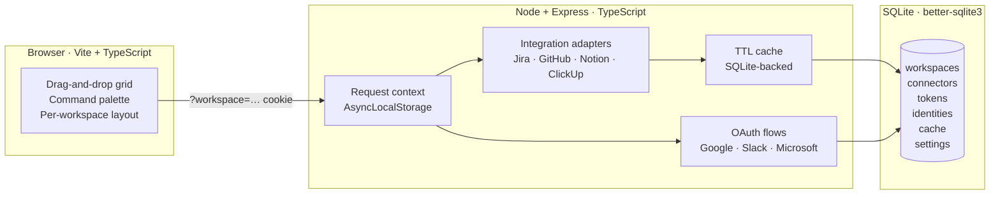

# Visuals Manifesto

> The single source of truth for every screenshot, diagram, and visual asset that ships with the project. If a doc references an image, that image must be specified below — what it shows, where it appears, and how to capture it cleanly.

This file exists because a strong open-source project is judged on its first scroll. A handful of crisp, intentional images turn a wall of text into something a stranger trusts in five seconds. The goal is not "lots of pictures" — it is **the right pictures, captured the same way every time.**

---

## Capture conventions (apply to every screenshot)

A screenshot is only as professional as the environment it was taken in. Before capturing **any** image below, do all of the following:

1. **Use a clean browser profile.** No extensions visible, no bookmarks bar, no third-party toolbars. Chrome → new profile → only Daily Command Center open.
2. **Run with mock / sanitised data.** Never ship a screenshot that contains real client names, real Slack messages, real co-worker faces, real ticket titles, or real PR titles. If in doubt, rename to generic placeholders (`Acme Corp`, `Project Atlas`, `@teammate`) before capturing.
3. **Hide every channel, DM, and ticket that could contain sensitive content.** Collapse them, or temporarily disconnect the connector for the capture.
4. **Use the default brand name "Daily Command Center"** unless a screenshot is specifically demonstrating white-labelling.
5. **Light theme for hero shots, dark theme for "developer" shots.** Both are fine, but pick one per image and stay consistent across a single doc page.
6. **Window size: 1440 × 900 logical px** (export 2× for retina → 2880 × 1800). Anything wider crops awkwardly inside GitHub's content column.
7. **Use system Chrome window chrome** (not a frameless capture) so it reads as a real app, not a mockup. macOS: `⌘ + Shift + 4`, then space-bar to capture window with shadow.
8. **PNG, not JPG.** UI screenshots compress poorly as JPG and the colour fringing looks amateur.
9. **Filename**: lower-kebab-case, descriptive of *content*, not placement. `dashboard-preview.png`, not `readme-top.png`.
10. **Optimise** through `pngquant --quality=80-95` or [tinypng.com](https://tinypng.com) before committing. Aim for < 400 KB per image.

---

## Required images

### 1. `dashboard-preview.png` — README hero
- **Where it appears**: [`README.md`](../README.md), immediately under the headline badges. The first image a visitor sees.
- **What it shows**: The full dashboard for a single workspace, default layout, populated with realistic-but-fake data. KPI strip across the top showing non-zero counts (e.g. `4 meetings · 7 mentions · 12 tickets · 3 PRs`). Schedule card on the left with the **Now** indicator line clearly visible across at least two events. Channel Digest centred. Pull Requests card on the right showing the four tabs with count badges. Header in light theme.
- **How to take it**: Clean profile → light theme (`T`) → seed mock data via SQLite or a connected sandbox account → resize window to exactly 1440 × 900 → press `R` to refresh so all cards render → wait for "Now" line to settle → capture full window with `⌘ + Shift + 4` then space.

### 2. `overview-mode.png` — Multi-workspace showcase
- **Where it appears**: [`README.md`](../README.md), within the "Features at a glance" section to illustrate the `✦ Overview` capability.
- **What it shows**: Header switcher set to `✦ Overview`. At least two workspaces' worth of cards rendered side by side — most importantly, two *different* GitHub PR cards (or two Jira/ClickUp cards), each with its own `Workspace · @account` source label clearly readable. The overlapped workspace-logo cluster at the top of each card should be visible.
- **How to take it**: Configure two workspaces (`Personal` + `Work`) → connect the same connector type to both with **Show in Overview ✦** toggled on → switch to Overview → capture as in #1.

### 3. `command-palette.png` — Power-user feature
- **Where it appears**: [`docs/FEATURES.md`](./FEATURES.md), inside the **Command palette** `<details>` block.
- **What it shows**: The `⌘K` palette open over a dimmed dashboard, with a fuzzy query partially typed (e.g. `tog`) and the four section headings (System / Workspaces / Navigation / Content) all visible with at least one matching entry each.
- **How to take it**: Open palette with `⌘K`, type a 3-letter query that matches across sections (`tog` matches "Toggle theme"; `ref` matches "Refresh all"), capture before the palette auto-closes.

### 4. `settings-workspaces.png` — Configuration depth
- **Where it appears**: [`docs/SETUP.md`](./SETUP.md), at the top of the **Connecting providers** section.
- **What it shows**: Settings panel open on the **Workspaces** tab. One workspace card expanded, exposing the per-type connector group UI — a `Shared from other workspaces` region, a `<Workspace>'s accounts` region, and the `+ Connect your own` action all in one frame. At least one connector with the **Share** and **Show in Overview ✦** toggles visible.
- **How to take it**: `,` → Workspaces tab → expand one card → if needed, scroll inside the panel so all three regions are visible in one frame.

### 5. `connector-setup-guide.png` — Onboarding quality signal
- **Where it appears**: [`docs/SETUP.md`](./SETUP.md), beside the in-app setup-guide note (line ~43).
- **What it shows**: A credentials form (Slack works well — three OAuth fields) with the `📖 View setup guide` accordion expanded directly below it, showing numbered steps with the redirect URI clearly visible. Demonstrates the "no guessing" promise.
- **How to take it**: Settings → Application tab → Slack section → click the View setup guide accordion → capture once it has fully expanded.

### 6. `keyboard-shortcuts.png` — Keyboard-first claim, proven
- **Where it appears**: [`docs/FEATURES.md`](./FEATURES.md), top of the **Keyboard shortcuts** section.
- **What it shows**: The `?` shortcut sheet overlay open on top of the dashboard. Every shortcut row legible.
- **How to take it**: Press `?` from the dashboard → capture the modal.

### 7. `dark-theme.png` — Aesthetics signal
- **Where it appears**: [`README.md`](../README.md) (optional — only add if the light hero shot is already present), or in [`docs/FEATURES.md`](./FEATURES.md) under "Header & global controls" → theme toggle.
- **What it shows**: Same composition as `dashboard-preview.png` but in dark theme. Good place to demonstrate the secondary clocks if Preferences are configured.
- **How to take it**: Identical to #1 with `T` toggled.

### 8. `architecture-diagram.svg` *(optional fallback)*
- **Where it appears**: [`README.md`](../README.md), Architecture section. **Only used as a fallback if the inline Mermaid diagram (below) ever fails to render.** Native Mermaid is preferred.
- **What it shows**: The same boxes-and-arrows as the Mermaid version (Browser ↔ Node server ↔ SQLite, OAuth flows, request-context).
- **How to make it**: Export from [excalidraw.com](https://excalidraw.com) or [tldraw.com](https://tldraw.com) using the same colour palette as the app (light grey nodes, blue accents).

---

## Architecture diagram (Mermaid — renders natively in GitHub)

The architecture diagram lives in the README directly as Mermaid source — GitHub renders it as an SVG without any build step, and edits land in the same PR as the code change they describe. Keep this block authoritative; the optional `architecture-diagram.svg` (above) only exists as a fallback.

````markdown

````

(The diagram above is shown as a fenced code sample so it stays escaped inside this manifesto. Paste the inner `mermaid` block — without the surrounding triple-backtick wrapper — into [`README.md`](../README.md) for live rendering.)

---

## Suggested placements at a glance

| Location | Image |
|---|---|
| `README.md` — Hero (under badges) | `dashboard-preview.png` |
| `README.md` — Features section | `overview-mode.png` |
| `README.md` — Architecture section | Mermaid diagram (inline) |
| `README.md` — *(optional)* aesthetics | `dark-theme.png` |
| `docs/FEATURES.md` — Command palette | `command-palette.png` |
| `docs/FEATURES.md` — Keyboard shortcuts | `keyboard-shortcuts.png` |
| `docs/SETUP.md` — Connecting providers | `settings-workspaces.png` |
| `docs/SETUP.md` — In-app setup guides note | `connector-setup-guide.png` |

---

## Maintenance rule

When a UI change makes a screenshot stale (a card is renamed, a tab is added, the colour palette shifts), recapture the affected image in the **same PR** as the code change. A stale screenshot is worse than no screenshot — it tells visitors the project isn't maintained.
